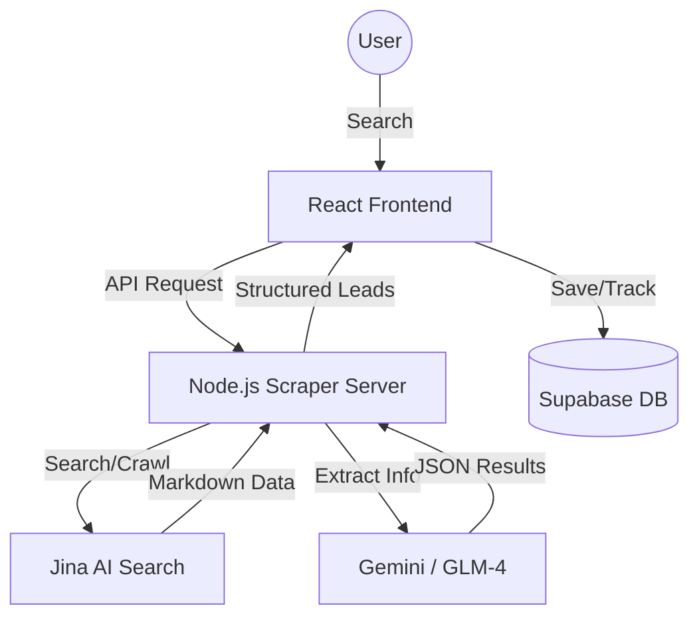

# Clutcher CRM - AI-Powered Sales Intelligence

Clutcher is a high-performance CRM and lead generation platform designed for rapid business discovery and outreach. It combines a sophisticated web scraper with LLM-powered intelligence to identify, track, and convert high-intent leads.

## 🚀 Tech Stack & Approach

- **Frontend**: React 18, TypeScript, Vite, Tailwind CSS
- **Design System**: Custom Glassmorphism UI with Vanilla CSS & Framer Motion for micro-animations
- **Database / Auth**: Supabase (PostgreSQL)
- **Intelligence Layer**: Jina AI (Search/Crawl) & Google Gemini / GLM-4 (Data Extraction)
- **Icons**: Lucide React
- **Analytics**: Recharts

**Our Approach**: We prioritize **visual excellence** and **data speed**. By leveraging Jina's search capabilities and LLMs, Clutcher transforms broad search queries into actionable business opportunities with social profiles and contact info ready for outreach.

## 🏗️ Architectural Overview



## 📁 Project Structure

```text
├── components/          # UI Components (Dashboard, Leads, Outreach, etc.)
│   └── ui/              # Reusable Base Components (GlassCard, etc.)
├── lib/
│   └── database/        # Supabase client & SQL Schema
├── server/              # Scraper Server (Express)
│   ├── scraper.ts       # Core Scraping & LLM extraction logic
│   └── index.ts         # Server entry point
├── constants.ts         # Shared configuration & mock data
├── types.ts             # TypeScript definitions
└── index.tsx            # Application entry point
```

## ⚙️ Environment Variables

Create a `.env.local` file in the root directory:

```env
# Supabase
VITE_SUPABASE_URL=your_supabase_url
VITE_SUPABASE_ANON_KEY=your_supabase_anon_key

# Scraper & Intelligence
JINA_API_KEY=your_jina_key        # Used for searching/crawling
GEMINI_API_KEY=your_gemini_key    # Used for LLM data extraction
SERVER_PORT=3001
```

## 🕵️ Scraper & LLM Layers

1. **Jina Search Layer**: Converts your intent (e.g., "Web design agencies in London") into high-quality search results and crawls business websites to extract raw text/markdown.
2. **LLM Extraction Layer**: Uses Gemini or GLM-4 to parse raw markdown. It identifies key-value pairs like business name, niche, email, phone number, and social media handles (LinkedIn, Twitter, Instagram).

## 🛠️ Local Setup

### 1. Database Setup

- Go to Supabase and create a new project.
- Run the code in `lib/database/schema.sql` inside the SQL Editor to initialize your tables and RLS policies.

### 2. Install Dependencies

```bash
npm install
```

### 3. Run the Development Server

```bash
# Terminal 1: Frontend
npm run dev

# Terminal 2: Scraper Server
npm run server
```

## 🌐 Hosting

- **Frontend**: Deploy to **Vercel** or **Netlify**. Connect your repository and it will auto-detect the Vite build.
- **Server**: Deploy the `server/` folder to **Render**, **Railway**, or **Heroku**.
- **Database**: Already hosted via **Supabase**.

---

_Built with passion by the Clutcher Team._
